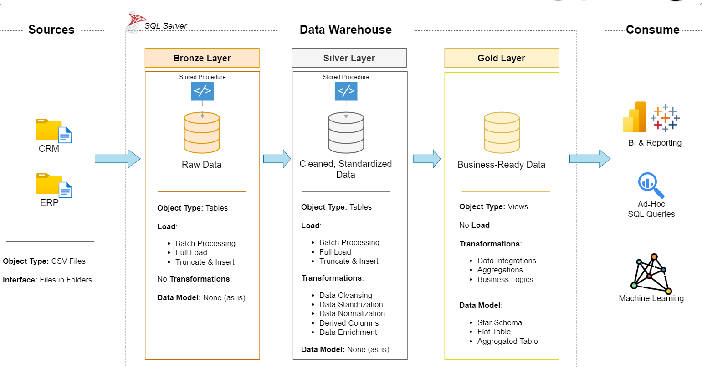

# Data Warehouse and Analytics Project

Welcome to the **Data Warehouse and Analytics Project** repository! 🚀

This project demonstrates the design and implementation of a modern **data warehouse and analytics solution using SQL Server**, covering the complete data pipeline from raw source data to actionable business insights.

The project follows a **Medallion Architecture** consisting of Bronze, Silver, and Gold layers, and uses an **ELT approach** to ingest, clean, transform, and model data into a business-ready **Star Schema**.

The goal of this project is to demonstrate practical skills in **data warehousing, SQL development, data transformation, dimensional modeling, and analytics**, following industry best practices.

## Data Architecture

The project follows a **Medallion Architecture** consisting of three main layers:

* **Bronze Layer:** Stores raw data as-is from the source systems, preserving the original data for traceability and reprocessing.
* **Silver Layer:** Cleans, validates, and transforms the raw data to prepare it for analytical use.
* **Gold Layer:** Contains business-ready data organized into a **Star Schema** with fact and dimension tables for reporting and analytics.

## 📖 Project Overview

This project involves:

1. **Data Architecture**: Designing a modern data warehouse using **Medallion Architecture**, consisting of **Bronze, Silver, and Gold** layers.
2. **ELT Pipelines**: Extracting and loading data from source systems, then transforming it within the data warehouse.
3. **Data Modeling**: Developing **fact and dimension tables** organized into a **Star Schema** for efficient analytical querying.
4. **Analytics & Reporting**: Creating **SQL-based reports and analytical queries** to generate actionable business insights.

